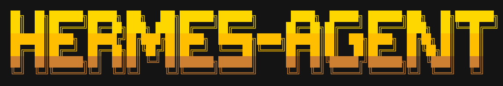

<p align="center">
  
</p>

# zhurai-agent

<p align="center">
  <a href="https://github.com/m1krot1k1/zhurai-agent">Репозиторий</a> |
  <a href="https://github.com/m1krot1k1/zhurai-agent/releases">Релизы</a> |
  <a href="https://github.com/m1krot1k1/zhurai-agent/issues">Обращения</a>
</p>

<p align="center">
  <a href="https://github.com/m1krot1k1/zhurai-agent/blob/main/LICENSE"></a>
</p>

**zhurai-agent** — форк [Hermes Agent](https://github.com/NousResearch/hermes-agent) с мультиагентной экосистемой, десктопным приложением и полноценным TUI. Проект объединяет автономного AI-агента с оркестрацией специализированных субагентов: планирование, код, тесты, документация, безопасность и другие роли работают параллельно под координацией оркестратора.

Работает локально на ноутбуке, на VPS или в облаке. Поддерживает разные LLM-провайдеры — переключение через `hermes model` без изменения кода.

---

## Возможности

| Компонент | Описание |
|-----------|----------|
| **Десктопное приложение** | Нативная оболочка на Electron (`apps/desktop/`): чат, встроенные агенты, управление сессиями и настройками из GUI |
| **TUI (терминал)** | Полноценный терминальный интерфейс: многострочный ввод, автодополнение slash-команд, история диалогов, прерывание и перенаправление задач, потоковый вывод инструментов |
| **Мультиагентная система** | 33 специализированных агента: `start`, `orchestrator`, `code`, `test-specialist`, `docs-specialist`, `security-auditor` и другие. Slash-команды: **`/start`**, **`/orchestrator`**, `/start-workflow` |
| **Шлюз сообщений** | Telegram, Discord, Slack, WhatsApp, Signal и CLI из одного процесса шлюза |
| **Навыки и память** | Автоматическое создание навыков, поиск по прошлым сессиям, сохранение контекста между запусками |
| **Инструменты** | 40+ встроенных инструментов, интеграция MCP, планировщик задач, делегирование субагентам |
| **Терминальные бэкенды** | local, Docker, SSH, Singularity, Modal, Daytona |

---

## Быстрый старт

### Linux, macOS, WSL2

```bash
curl -fsSL https://raw.githubusercontent.com/m1krot1k1/zhurai-agent/main/scripts/install.sh | bash
```

### Windows (PowerShell)

```powershell
iex (irm https://raw.githubusercontent.com/m1krot1k1/zhurai-agent/main/scripts/install.ps1)
```

После установки:

```bash
source ~/.bashrc    # или: source ~/.zshrc
hermes              # запуск TUI
```

### Установка из клона репозитория

```bash
git clone https://github.com/m1krot1k1/zhurai-agent.git
cd zhurai-agent
bash scripts/install.sh
```

Для разработки:

```bash
curl -LsSf https://astral.sh/uv/install.sh | sh
uv venv .venv --python 3.11
source .venv/bin/activate
uv pip install -e ".[all,dev]"
```

---

## Обновление

Обновить установленную версию из репозитория zhurai-agent:

```bash
hermes update
```

Или вручную из каталога установки:

```bash
cd "${HERMES_HOME:-$HOME/.hermes}/zhurai-agent"
git pull origin main
uv pip install -e ".[all]"
```

Актуальные сборки десктопного приложения — в [релизах](https://github.com/m1krot1k1/zhurai-agent/releases).

---

## Основные команды

```bash
hermes              # интерактивный TUI
hermes model        # выбор LLM-провайдера и модели
hermes tools        # настройка инструментов
hermes config set   # параметры конфигурации
hermes gateway      # шлюз сообщений (Telegram, Discord и др.)
hermes setup        # мастер первоначальной настройки
hermes update       # обновление до последней версии
hermes doctor       # диагностика проблем
```

### Мультиагентный режим

В Cursor и совместимых средах доступны slash-команды для делегирования:

```text
/start              # запуск оркестратора для сложных задач
/orchestrator       # координация параллельных веток
/code               # реализация кода
/review             # ревью кода
```

Полный список агентов и правила маршрутизации — в каталогах `agents/`, `rules/` и `skills/`.

---

## Десктопное приложение

Десктопная версия находится в `apps/desktop/`. Сборка из исходников:

```bash
cd apps/desktop
npm install
npm run dev          # режим разработки
npm run dist:mac     # сборка для macOS
npm run dist:win     # сборка для Windows
npm run dist:linux   # сборка для Linux
```

Готовые установщики публикуются в [Releases](https://github.com/m1krot1k1/zhurai-agent/releases).

---

## Структура репозитория

```text
zhurai-agent/
├── apps/desktop/       # десктопное приложение (Electron)
├── agents/             # определения 33 агентов экосистемы
├── rules/              # правила маршрутизации и оркестрации
├── skills/             # навыки агентов и Hermes (SKILL.md)
├── scripts/            # установщики, тесты, утилиты
├── plugins/            # плагины (память, расширения)
├── pyproject.toml      # Python-пакет hermes-agent
├── CONTRIBUTING.md     # руководство для контрибьюторов
└── LICENSE             # MIT
```

---

## Участие в разработке

Баги и предложения — через [обращения](https://github.com/m1krot1k1/zhurai-agent/issues).

Перед началом работы:

```bash
git clone https://github.com/m1krot1k1/zhurai-agent.git
cd zhurai-agent
bash scripts/install.sh
cd "${HERMES_HOME:-$HOME/.hermes}/zhurai-agent"
uv pip install -e ".[all,dev]"
scripts/run_tests.sh
```

Подробности — в [CONTRIBUTING.md](CONTRIBUTING.md).

---

## Релизы desktop (macOS)

| Ветка | Версионирование | GitHub Release |
|-------|-----------------|----------------|
| `dev` | **minor** (0.17.0 → 0.18.0) | prerelease |
| `main` | **major** (0.x → 1.0.0) | stable |

При push в **`dev`** (изменения в `apps/desktop/`, `skills/`, `agents/`, `commands/` и др.) CI автоматически:

1. Поднимает версию в `apps/desktop/package.json`
2. Собирает `.dmg` и `.zip` на macOS ARM64
3. Публикует в [Releases](https://github.com/m1krot1k1/zhurai-agent/releases)

**In-app обновления** смотрят на ветку **`dev`** (не `main`). Если About пишет «latest», а в GitHub уже есть коммиты — см. [docs/desktop-updates.md](docs/desktop-updates.md).

**Локальная сборка** (автоустановка Node 22 через nvm):

```bash
bash scripts/build-desktop-macos.sh
```

Артефакты: `apps/desktop/release/ZhurAI-Agent-*-mac-arm64.dmg`

**macOS «приложение повреждено» после скачивания?** Это Gatekeeper + quarantine, не битый файл. Оригинальный Hermes подписан Apple; наши open-source релизы — ad-hoc. После установки:

```bash
bash scripts/fix-macos-gatekeeper.sh "/Applications/ZhurAI Agent.app"
```

Подробнее: [docs/desktop-macos-signing.md](docs/desktop-macos-signing.md)

**Публикация в GitHub Releases** (нужен [GitHub CLI](https://cli.github.com/): `brew install gh && gh auth login`):

```bash
bash scripts/release-desktop-github.sh minor   # dev / prerelease
bash scripts/release-desktop-github.sh major    # stable на main
```

**CI** (ветка `dev` → minor, Actions → Run workflow на `main` → major): см. `.github/workflows/release-desktop-macos.yml`. Если job падает на *Set up job* — в Settings → Actions включите runners и проверьте лимит macOS-минут.

---

## Лицензия

Проект распространяется под лицензией [MIT](https://github.com/m1krot1k1/zhurai-agent/blob/main/LICENSE).

Основан на [Hermes Agent](https://github.com/NousResearch/hermes-agent) от Nous Research.
