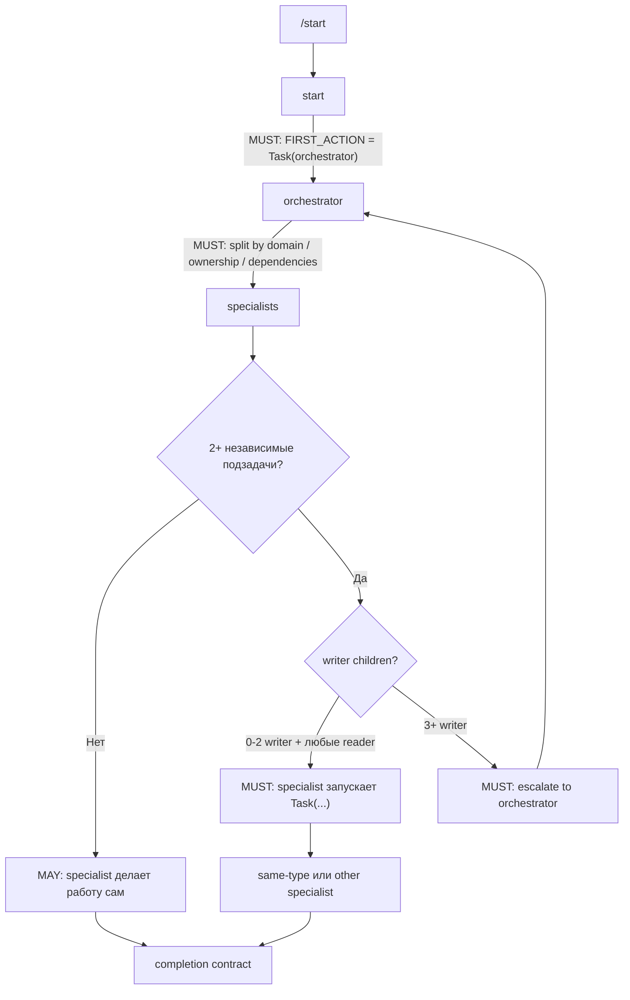

# Быстрый старт: flat-chain оркестрация

## Когда что вызывать

1. Сформулируйте цель и границы: что сделать, что не трогать, какой результат считать готовым.
2. Для **одного домена и немногих файлов** вызывайте профильного специалиста напрямую: `/code`, `/frontend-specialist`, `/debug`, `/test-specialist`.
3. Для **многошаговой, многодоменной или 24/7 задачи** используйте **`/start`**.

## Каноническая схема



Короткая запись того же канона:

```text
/start
  -> start
  -> Task(orchestrator, ORIGINAL_REQUEST: {...})
  -> specialists
```

## Инварианты новой цепочки

- Root `start` не читает репозиторий и не запускает команды до handoff.
- Первый tool call root `start` всегда `Task(orchestrator)`.
- `ORIGINAL_REQUEST` передаётся дословно.
- Root `start` не вызывает специалистов напрямую.
- Specialists могут использовать `Task()` для своих подзадач по правилам Mandatory SWARM.
- `Task(start, ENTRY_MODE: supervised_worker)` не является частью активной цепочки и считается legacy drift.
- Если `Task` недоступен, результат должен быть `MULTI_AGENT_PIPELINE_BLOCKED`, а не single-agent fallback.

## MUST > MAY > MUST ESCALATE

Внутри specialist branch (`code`, `test-specialist`, `frontend-specialist`, `docs-specialist`) порядок всегда один:

1. **MUST delegate** — если есть **2+ независимые подзадачи**
2. **MAY execute directly** — только если задача маленькая и неделимая
3. **MUST escalate** — если локально получилось **3+ writer children**

| Ситуация | Что делать |
|---|---|
| 2+ независимые подзадачи | Specialist **обязан** запускать `Task()` |
| 1 маленькая задача без деления | Specialist **может** сделать сам |
| Same-type child | **Можно**, если child scope уже |
| Другой specialist | **Можно**, если это domain-fit |
| 3+ writer children | **Обязательная** эскалация в `orchestrator` |

## 24/7 и open-ended

При `CONTINUOUS_MODE: until_user_stop` root `start` запускает волны напрямую через orchestrator:

```text
Wave 1: start -> Task(orchestrator, WAVE_NUMBER: 1)
Wave 2: start -> Task(orchestrator, WAVE_NUMBER: 2)
Wave 3: start -> Task(orchestrator, WAVE_NUMBER: 3)
```

Закрытие одной волны не завершает весь цикл автоматически. Для open-ended режима нужны либо следующая волна, либо доказанный `steady_state`.

## Запрещённые паттерны

- `Task(start, ENTRY_MODE: supervised_worker)` из root `start`.
- Root `start` -> `Task(code|debug|...)` в обход orchestrator.
- Root `start` читает repo, пишет код и потом делегирует "acknowledge".
- Сообщение вида "Нет Task - выполняем напрямую".

## См. также

- [delegation-chain.md](./delegation-chain.md) — единый источник правды по маршрутизации.
- [start-workflow.md](./start-workflow.md) — runbook для `/start`.
- [autonomous-task-with-verification.md](./autonomous-task-with-verification.md) — analyzer-only цикл.
- [start-workflow/SKILL.md](../skills/start-workflow/SKILL.md) — автономное исполнение и формат ответа (объединено с `/start` workflow).
