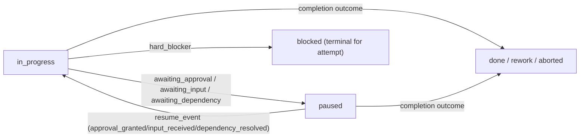

# Stable `/start` Operator Workflow

This runbook documents the stable entry flow for `/start` and the minimal checks an operator uses to run a wave safely.

Policy anchors (do not reinterpret in this doc):
- `rules/specialists.mdc`
- `rules/orchestrator.mdc`
- `rules/aleksander.mdc`
- `skills/start-workflow/SKILL.md`

## Canonical sequence

Use this sequence as the baseline handoff chain:

1. User sends `/start`.
2. Root `start` runs STEP 0 (reasoning: capture request, detect `CONTINUOUS_MODE`, `OPEN_ENDED_IMPROVEMENT`, trust boundary) — **no tool calls**.
3. Root `start` runs **STEP 0.5**: outputs an **inline brief** in the **same turn** (objective restatement, mode, wave plan hint). This is user-facing text/reasoning only — **not** a tool call, **not** a blocking pause. Under active DUA (`/start`), brief and delegation happen in one turn without waiting for confirmation.
4. Root `start` launches **`Task(orchestrator, …)` directly** as the **first and only** tool call in that turn. Worker-start has been removed from the active chain to keep `/start` flat, auditable, and free of an extra routing hop; nested subagents may still use `Task()` when their own rules allow it. **`ORIGINAL_REQUEST` in the orchestrator prompt must be verbatim** — the brief may paraphrase for the user only.
5. `orchestrator` opens specialist branches (`code`, `docs-specialist`, `security-auditor`, and others by scope).
6. Specialists return completion contracts to `orchestrator`.
7. `orchestrator` synthesizes branch outcomes and returns wave result.
8. Root `start` incorporates the wave outcome / `START_REPORT` semantics and decides continue, pause, or stop based on policy gates.

Reference detail: `docs/delegation-chain.md` and `docs/quick-start-orchestration.md`.

## Canonical runtime states (approval / blocked / pause / resume)

Use a single state contour for all branches and completion contracts:

- `approval_state`: `not_required | requested | approved | rejected`
- `execution_state`: `in_progress | paused | blocked | done | rework | aborted`

Rules:
- High-risk actions (deploy/publish/external side effects/secrets/destructive ops) must request approval and move execution to `paused`.
- `paused` is resumable and means the branch is waiting for external input (approval, user input, dependency).
- `blocked` is terminal for the current attempt and must escalate with reason; do not continue this branch.
- Resume is allowed only from `paused` via explicit event (`approval_granted`, `input_received`, `dependency_resolved`).
- Forbidden transitions: `blocked -> in_progress` and `blocked -> done` without new branch/replan.

## Canonical wire-format and compatibility

Runtime status in branch contracts, telemetry, and handoff envelopes must always use this wire-format:

```json
{
  "status": "approval|pause|blocked|resume",
  "approval_state": "not_required|requested|approved|rejected",
  "execution_state": "in_progress|paused|blocked|done|rework|aborted"
}
```

Packet translation rule:
- `resume_packet` is the runtime output payload emitted when a wave pauses and expects explicit continuation.
- Root `start` passes that payload into the next `Task(orchestrator, ...)` call as `CONTINUATION_PACKET` or via a `relay_resume` envelope.
- Do not treat `resume_packet` and `CONTINUATION_PACKET` as competing runtime states: they are output-vs-input views of the same continuation payload.

Compatibility policy:
- Allowed: keep legacy workflow labels in human-facing docs/checklists (`Proposed`, `InReview`, etc.) only when an explicit mapping to canonical fields is provided next to the table/checklist.
- Not allowed: emit legacy labels as runtime branch status, completion-contract state, or telemetry state.
- Required: when a document uses domain workflow labels, clearly separate them from runtime status and specify mapping rules.
- Recommended migration: if a section has mixed labels without mapping, treat it as documentation drift and update before next wave.



## Minimal handoff contract

When preparing a `/start` wave, keep these fields explicit in prompts/contracts:
- `OBJECTIVE`
- `SCOPE`
- `OUT_OF_SCOPE`
- `OWNERSHIP`
- `DEPENDENCIES`
- `ACCEPTANCE_CRITERIA`
- `COMPLETION_CONTRACT`

These fields are required by `rules/orchestrator.mdc` envelope rules and prevent ambiguous branch execution.

## Troubleshooting blocked delegation

### 1) `Task` / `Task(...)` unavailable

Symptoms:
- delegation cannot start;
- child Task count is `0` in a path that requires multi-agent execution.

Operator action:
1. Treat this as runtime block, not successful orchestration.
2. Record a blocked status aligned with `MULTI_AGENT_PIPELINE_BLOCKED` semantics from `rules/orchestrator.mdc`.
3. Do not convert to single-agent execution unless explicitly allowed by policy and user instruction.

### 2) Policy gate failure on handoff chain

Symptoms:
- root `start` attempts direct specialist work (bypassing `Task(orchestrator)`);
- missing **`Task(orchestrator)`** after root `start`;
- reliance on deprecated worker-start hop.

Operator action:
1. Re-run from canonical chain: `/start` → **`Task(orchestrator)`** → specialists.
2. Verify the chain against `rules/specialists.mdc` and `docs/delegation-chain.md`.
3. Mark branch `rework` until chain semantics are restored.

### 3) OWNERSHIP or scope collisions across branches

Symptoms:
- two writing branches target overlapping files;
- branch work leaks outside declared scope.

Operator action:
1. Split ownership into disjoint file sets before rerun.
2. Keep only one active writer per owned path set.
3. Re-check `OWNERSHIP` and `OUT_OF_SCOPE` in each branch envelope.

### 4) Missing evidence for "done" claims

Symptoms:
- completion without file-level proof or checks.

Operator action:
1. Reject the completion claim.
2. Require completion contract evidence (files changed, checks, AC mapping).
3. Use anti-hallucination expectations from `rules/aleksander.mdc`.

## Operator checklist (per wave)

- [ ] Confirm canonical paths: edit only `agents/`, `rules/`, `skills/`, `docs/` as source-of-truth areas.
- [ ] Confirm target PBI/task and scope before execution.
- [ ] STEP 0.5: root `start` emitted inline brief (objective + mode + wave hint) in same turn as `Task(orchestrator)` — no blocking pause under DUA `/start`.
- [ ] Verify `/start` chain includes **`Task(orchestrator)`** directly from root `start` (worker-start deprecated); first tool call = `Task(orchestrator)` only.
- [ ] Verify `ORIGINAL_REQUEST` in orchestrator prompt is verbatim user text.
- [ ] Ensure each branch envelope has ownership and measurable AC.
- [ ] For each branch, record both `approval_state` and `execution_state`; use only canonical transitions.
- [ ] Run the benchmark/verification pass relevant to current wave policy (for this repo: `scripts/run-full-repo-benchmark.py` or documented equivalent).
- [ ] Update planning artifacts (`.plan/todos.md`, `.plan/session-context.md`) and delivery record (`docs/delivery/backlog.md`).
- [ ] Record final runtime state via canonical pair (`approval_state`, `execution_state`) with explicit evidence and escalation reason for `execution_state=blocked`.

## Evidence expectations

For each completed `/start` wave, keep:
- path-level evidence of doc/rule/skill updates;
- check outputs for verification/benchmark step;
- acceptance criteria mapping per active task.

This keeps wave decisions auditable and aligned with existing rule contracts.
