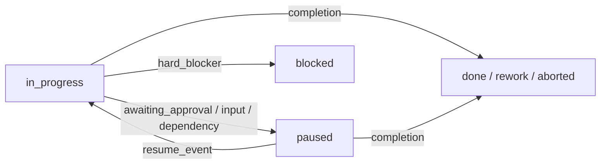

# `/start` operator workflow (ZCode)

Stable entry flow for `/start` and minimal checks to run a wave safely in the **multi-agent-ecosystem** plugin.

**Policy anchors** (do not reinterpret here):

- `references/rules/specialists.mdc`
- `references/rules/orchestrator.mdc`
- `references/rules/aleksander.mdc`
- `references/skills/start-workflow/SKILL.md` (if present)

## Canonical sequence

1. User sends `/start` with a task description.
2. **Start router** (`commands/start.md`) hands off to **orchestrator mode** with `ORIGINAL_REQUEST` verbatim. No worker-start hop.
3. **Orchestrator** opens specialist branches per [routing-table.md](./routing-table.md).
4. Specialists return [completion contracts](./completion-contracts.md) to orchestrator.
5. Orchestrator synthesizes branch outcomes and returns the wave result.
6. Start router applies footer semantics and decides continue, pause, or stop per policy gates.

Detail: [delegation-chain.md](./delegation-chain.md).

## DUA (Direct User Authorization)

**DUA is active** when the user:

- Uses an imperative verb ("implement", "fix", "write", "сделай")
- Uses a slash command (`/start`, `/code`, `/orchestrator`)
- Says "just do it" or equivalent

**DUA enables:**

- Immediate action without extra confirmation
- Full tool access within scope
- Optional PBI/task prerequisites

**DUA does not override:**

- Code quality and evidence requirements
- Anti-loop limits
- Destructive-operation confirmation (DROP, `rm -rf`, force push)
- Security best practices in code (not refusal of user scope)

Default autonomy tier: **Medium**. Override with `DUA:HIGH` or `DUA:LOW` in the branch envelope.

| Tier | Behavior |
|------|----------|
| High | Full autonomy; stop only on critical blocker |
| Medium | Checkpoint every 3+ steps; resolve ambiguity before start |
| Low | Confirm each critical decision |

## Act-first execution

1. Normalize: goal → SCOPE → STEPS → AC
2. Resolve ambiguity (High DUA: document assumptions; Medium/Low: ask if blocking)
3. Load context: read relevant files **after** routing, before edits
4. Parallel-first for independent branches
5. Anti-loop: 3 iterations without progress → escalate or replan
6. Close with evidence and mandatory footer

## Mandatory response footer

Every completed wave or specialist delivery ends with:

```markdown
## Краткая сводка
[1–3 sentences: what was done, what changed, AC status]

## Векторы улучшения
- [What to improve on the next run]
```

Optional expanded detail after `+` when the parent requests it.

## Continuous mode

| Mode | Trigger | Behavior |
|------|---------|----------|
| `single_wave` | default | One orchestrator wave → result |
| `until_user_stop` | "24/7", "swarm", "until I say stop" | Loop waves until stop |
| `OPEN_ENDED_IMPROVEMENT` | "improve everything", open-ended audit | No steady-state stop without `resume_packet` or `remaining_vectors: 0` |

Root `/start` with `until_user_stop` launches the next orchestrator wave after each synthesis — see [delegation-chain.md](./delegation-chain.md).

## Canonical runtime states

Use one state contour for all branches:

- `approval_state`: `not_required | requested | approved | rejected`
- `execution_state`: `in_progress | paused | blocked | done | rework | aborted`

**Rules:**

- High-risk actions (deploy, publish, secrets, destructive ops) → `approval_state=requested`, `execution_state=paused`
- `paused` = waiting for approval, user input, or dependency — **resumable**
- `blocked` = terminal for this attempt — escalate; no `blocked → done` without replan
- Resume only from `paused` via `approval_granted`, `input_received`, or `dependency_resolved`



### Wire format (branch contracts)

```json
{
  "status": "approval|pause|blocked|resume",
  "approval_state": "not_required|requested|approved|rejected",
  "execution_state": "in_progress|paused|blocked|done|rework|aborted"
}
```

Human workflow labels (`Proposed`, `InReview`, …) are allowed in docs only with an explicit mapping to the canonical pair above. Do not emit legacy labels as runtime branch status.

## Minimal handoff envelope

Required before spawning a branch — full schema in [completion-contracts.md](./completion-contracts.md):

- `OBJECTIVE`
- `SCOPE` / `OUT_OF_SCOPE`
- `OWNERSHIP`
- `DEPENDENCIES`
- `ACCEPTANCE_CRITERIA`
- `NON-NEGOTIABLE` (must include `PENALIZED`)
- `COMPLETION_CONTRACT`

## Troubleshooting

### Sub-session / parallel agent unavailable

**Symptoms:** delegation cannot start; zero child branches on a multi-branch task.

**Action:** Record blocked status (`MULTI_AGENT_PIPELINE_BLOCKED`). Do not silently collapse to single-agent execution.

### Policy gate failure

**Symptoms:** start router edits repo before orchestrator; missing orchestrator handoff; deprecated worker-start hop.

**Action:** Re-run canonical chain per [delegation-chain.md](./delegation-chain.md). Mark branch `rework` until restored.

### OWNERSHIP collision

**Symptoms:** two writer branches touch the same files.

**Action:** Split into disjoint `OWNERSHIP` sets. One active writer per path set.

### Missing evidence

**Symptoms:** "done" without files, checks, or AC mapping.

**Action:** Reject claim. Require [evidence-first-acceptance.md](./evidence-first-acceptance.md) matrix.

## Operator checklist (per wave)

- [ ] Canonical paths: edit plugin source under `skills/multi-agent-ecosystem/` per [zcode-paths.md](./zcode-paths.md)
- [ ] Scope and AC explicit before execution
- [ ] `/start` chain includes orchestrator handoff (no worker-start)
- [ ] Each branch has disjoint `OWNERSHIP` and measurable AC
- [ ] Record `approval_state` + `execution_state` with evidence
- [ ] Run verification relevant to the wave (tests, lint, or documented equivalent)
- [ ] Update planning artifacts if the project uses `.plan/` (optional per project)
- [ ] Write mandatory footer

## Human-in-the-loop hard stops

Never autonomous without explicit user approval:

- Secrets, production credentials, token config
- Deploy, publish, unapproved network egress
- Destructive git, `rm -rf`, `DROP`, bulk overwrite

Send a **STOP packet**: proposed action, risk, reversibility, exact commands, files, safe alternative. Resume only on explicit approval.

## Evidence expectations

Per wave, retain:

- Path-level evidence of changes
- Check outputs (tests, validators)
- AC mapping per [evidence-first-acceptance.md](./evidence-first-acceptance.md)
